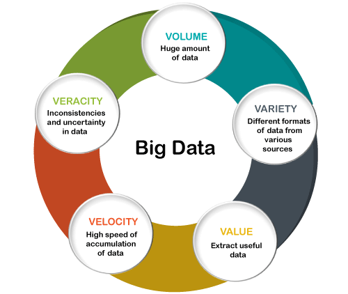

```{r, include=FALSE,warning=FALSE,message=FALSE}
options(htmltools.dir.version = FALSE)
knitr::opts_chunk$set(
  message = FALSE,
  warning = FALSE,
  dev = "svg",
  fig.align = "center",
  #fig.width = 11,
  #fig.height = 5
  cache = TRUE
)

# define vars
om = par("mar")
lowtop = c(om[1],om[2],0.1,om[4])
library(tidyverse)
library(knitr)
library(reticulate)
use_python("C:\\ProgramData\\Anaconda3\\python.exe")
#use_python("C:\\python\\python.exe")
options(dplyr.print_min = 5)
options(reticulate.repl.quiet = TRUE)
```


layout: false
class: title-slide-section-red, middle

# Course Goals

Justin Post

---
layout: true

<div class="my-footer"></div> 

---

# Welcome to Big Data Analysis!

What is Big Data?

.left45[
- 5 V's of Big Data
    + Volume
    + Variety
    + Velocity
    + Veracity (Variability)
    + Value
]

.right55[
```{r, echo = FALSE, out.width = "500px"}

```
]

---

# Course Plan

- Course split into four topics

    1. Programming in `python`

    2. Big Data Management

    3. Modeling Big Data (with `Spark` via `pyspark`)

    4. Streaming Data


---

# What is Python?

- A very high-level language  

- General purpose  

- Interpreted language  

--

- Many modules available to form the basis of your program  

- Spacing used to write blocks of code  

```{python}
def square(arg1):
    return arg1**2

square(arg1 = 10)
```

---

# Programming in Python (Prep for Dealing with Big Data)

- `JupyterLab` as our IDE (interactive development environment)
- Basic Use of Python
- Markdown capabilities of `JupyterLab`
- Python Modules


---

# Programming in Python (Prep for Dealing with Big Data)

- `JupyterLab` as our IDE (interactive development environment)
- Basic Use of Python
- Markdown capabilities of `JupyterLab`
- Python Modules

<br>

- Basic data types & Writing Functions
- Control flow (if/then/else, Looping)
- Summarizing Data Ideas

---

# Programming in Python (Prep for Dealing with Big Data)

- `JupyterLab` as our IDE (interactive development environment)
- Basic Use of Python
- Markdown capabilities of `JupyterLab`
- Python Modules

<br>

- Basic data types & Writing Functions
- Control flow (if/then/else, Looping)
- Summarizing Data Ideas

<br>

- Compound data types (including `Numpy` arrays, `pandas` data frames)
- Summarizing data
- Common models and model evaluation


---

# What Environment Will We Program In?

[JupyterLab](https://jupyterlab.readthedocs.io/en/stable/getting_started/overview.html)

+ Focused on interactive, exploratory computing
+ Start with Google Colab and move to JupyterLab on a JupyterHub to run spark

---

# JupyterLab

- **Notebooks**  

    + Work through *cells*
    
    + Cells can contain formatted text (via markdown), python code, or raw text (for JupyterLab)
    
    + Text cells can have math type, images, widgets, and more
    
    + Code cells allow you to submit code and output will be placed below the cell
    

---

# Recap

.left45[
- 5 V's of Big Data
    + Volume
    + Variety
    + Velocity
    + Veracity (Variability)
    + Value
]

.right45[
- Course split into four topics

    1. Programming in `python` (using JupyterLab)

    2. Big Data Management

    3. Modeling Big Data

    4. Streaming Data
]
