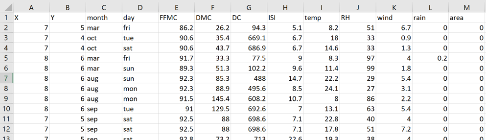
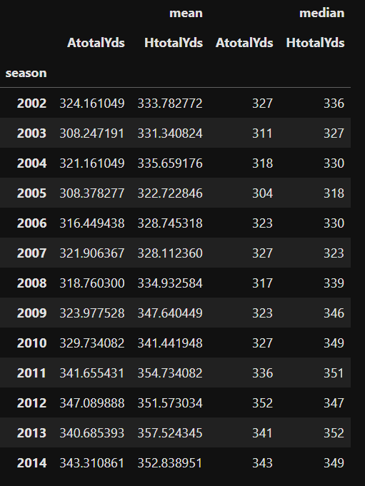
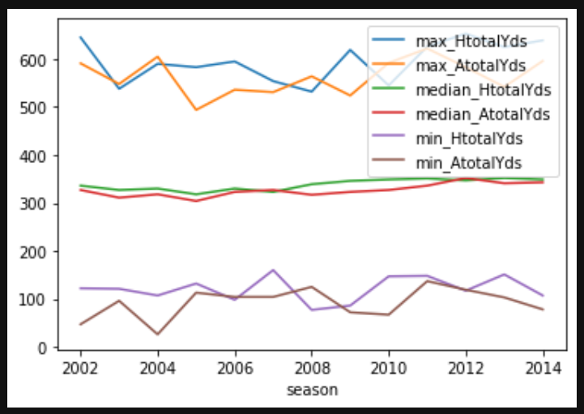
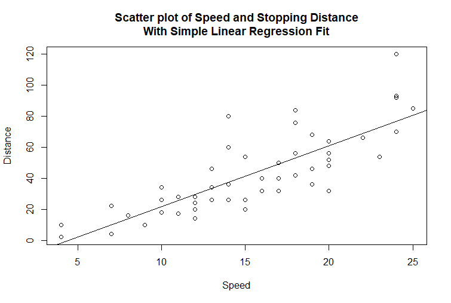
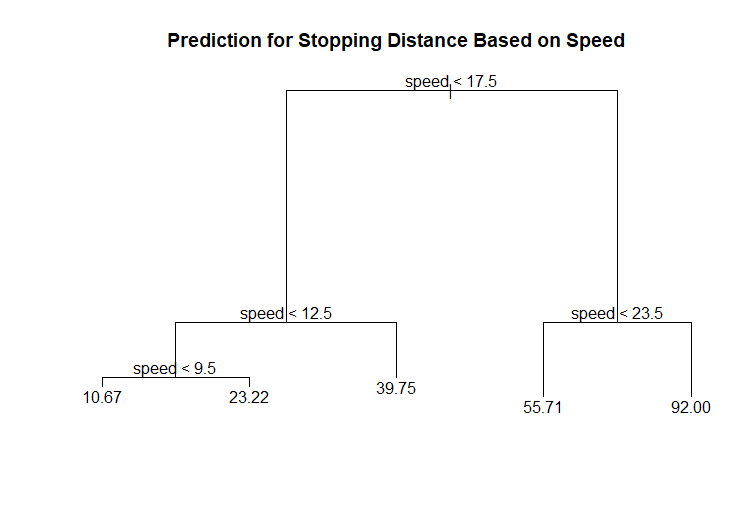
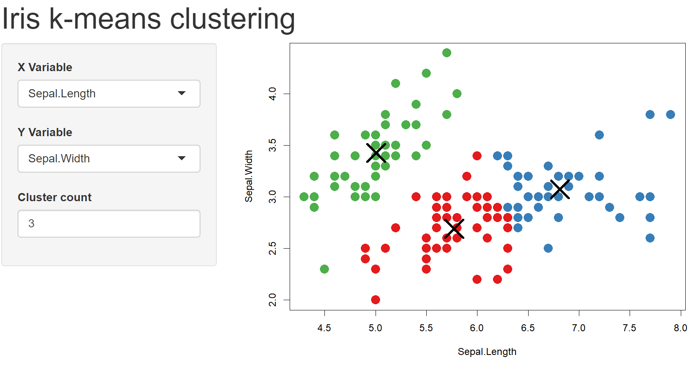

```{r, include=FALSE,warning=FALSE,message=FALSE}
options(htmltools.dir.version = FALSE)
knitr::opts_chunk$set(
  message = FALSE,
  warning = FALSE,
  dev = "svg",
  fig.align = "center",
  #fig.width = 11,
  #fig.height = 5
  cache = TRUE
)

# define vars
om = par("mar")
lowtop = c(om[1],om[2],0.1,om[4])
library(tidyverse)
library(knitr)
library(reticulate)
use_python("C:\\ProgramData\\Anaconda3\\python.exe")
#use_python("C:\\python\\python.exe")
options(dplyr.print_min = 5)
options(reticulate.repl.quiet = TRUE)
```


layout: false
class: title-slide-section-red, middle

# Common Uses for Data

Justin Post

---
layout: true

<div class="my-footer"></div> 

---

# Big Picture

.left45[
- 5 V's of Big Data
    + Volume
    + Variety
    + Velocity
    + Veracity (Variability)
    + Value

- Will look at the Big Data pipeline later
    + Databases/Data Lakes/Data Warehouses/etc.
    + SQL basics
    + Hadoop & Spark
]

.right50[
```{r, echo = FALSE, out.width = "370px"}
knitr::include_graphics("img/big-data-characteristics.png")
```
]

--

- **What to do with the data?**


---

# Statistical Learning

**Statistical learning** - Inference, prediction/classification, and pattern finding

- Supervised learning - a variable (or variables) represents an **output** or **response** of interest

--

    + May model response and
        - Make **inference** on the model parameters  
        - **predict** a value or **classify** an observation

--

- Unsupervised learning - **No output or response variable** to shoot for  

    + Goal - learn about patterns and relationships in the data

---

# Standard Rectangular Data

```{r, echo = FALSE, out.width = '850px', fig.align = 'center'}

```


---

# Data Driven Goals

Four major goals when using data:  

1. Description 

<div style="float: left; width: 45%;">
```{r, echo = FALSE, out.width='270px', fig.align='center'}

```
</div>
<div style="float: right; width: 45%;">
```{r, echo = FALSE, out.width='500px', fig.align='center'}

```
</div>
<!--comment-->

---

# Data Driven Goals

Four major goals when using data:  

<ol start = "2">
<li> Prediction/Classification</li>
</ol>

<div style="float: left; width: 45%;">
```{r, echo = FALSE, out.width='600px', fig.align='center'}

```
</div>
<div style="float: left; width: 45%;">
```{r, echo = FALSE, out.width='600px', fig.align='center'}

```
</div>


---

# Data Driven Goals

Four major goals when using data:  

<ol start = "3">
<li> Inference</li>
<ul> 
<li> Confidence Intervals</lis>
<li> Hypothesis Testing</li>
</ul>
</ol>


---

# Data Driven Goals

Four major goals when using data:  

<ol start = "4">
<li> Pattern Finding</li>
</ol>

```{r, echo = FALSE, out.width='650px', fig.align='center'}

```


---

# 1. Describing Data

Goal: Describe the **distribution** of the variable  

- Distribution = pattern and frequency with which you observe a variable  

- Numeric variable - entries are a numerical value where math can be performed

--

For a single numeric variable,
+ Shape: Histogram, Density plot, ...
+ Measures of center: Mean, Median, ...
+ Measures of spread: Variance, Standard Deviation, Quartiles, IQR, ...

--

For two numeric variables,
+ Shape: Scatter plot
+ Measures of Dependence: Correlation


---

# Quick Example

Read in some data

```{python}
import pandas as pd
wine_data = pd.read_csv("https://www4.stat.ncsu.edu/~online/datasets/winequality-full.csv")
wine_data.head()
```


---

# Lots of Summaries! 

- Use the `describe()` method on a `pandas` data frame 

```{python}
wine_data.describe()
```


---

# Graphs

- Many standard graphs to summarize with as well

.left45[
```{python, fig.align = "center", out.width = "350px"}
wine_data.alcohol.plot.density()
```
]
.right45[
```{python, fig.align = "center", out.width = "350px"}
wine_data.plot.scatter(x = "alcohol", y = "residual sugar")
```
]

---

# 2. Prediction/Classification

- A mathematical representation of some phenomenon on which you've observed data
- Form of the model can vary greatly!

--

**Simple Linear Regression Model**

$$\mbox{response = intercept + slope*predictor + Error}$$
$$Y_i = \beta_0+\beta_1x_i+E_i$$

--

- Assumptions often made about the data generating process to make inference (not required)


---

# Simple Linear Regression Model

- We'll learn how to 'fit' this model later

```{python}
from sklearn import linear_model
reg = linear_model.LinearRegression() #Create a reg object
reg.fit(X = wine_data['alcohol'].values.reshape(-1,1), y = wine_data['residual sugar'].values) 
print(round(reg.intercept_, 3), round(reg.coef_[0], 3))
```


---

# Simple Linear Regression Model

```{python, out.width='400px', fig.align='center'}
import seaborn as sns
sns.regplot(x = wine_data["alcohol"], y = wine_data["residual sugar"], scatter_kws={'s':2})
```


---

# 2. Prediction/Classification

- A mathematical representation of some phenomenon on which you've observed data
- Form of the model can vary greatly!

**Regression Tree**

- This model can be used for prediction

```{python}
from sklearn.tree import DecisionTreeRegressor
reg_tree = DecisionTreeRegressor(max_depth=2)
reg_tree.fit(X = wine_data['alcohol'].values.reshape(-1,1), y = wine_data['residual sugar'].values)
```


---

# Regression Tree

- This model can be used for prediction

```{python, out.width='450px', fig.align='center'}
from sklearn.tree import plot_tree
plot_tree(reg_tree)
```


---

# 2. Prediction/Classification

- A mathematical representation of some phenomenon on which you've observed data
- Form of the model can vary greatly!

**Logistic Regression** 

- Consider binary response and classification as the task
$$P(\mbox{success}|\mbox{predictor}) = \frac{e^{\mbox{intercept+slope*predictor}}}{1+e^{\mbox{intercept+slope*predictor}}}$$
$$P(\mbox{success}|\mbox{predictor}) = \frac{e^{\beta_0+\beta_1x}}{1+e^{\beta_0+\beta_1x}}$$
--

We'll investigate a number of different models later in the course!

<!--- Classify result as a 'success' for values of the predictor where this probability is larger than 0.5 (otherwise classify as a 'failure')-->

---

# Recap

Four major goals with data:
1. Description
2. Prediction/Classification
3. Inference
4. Pattern Finding

- Descriptive Statistics try to summarize the distribution of the variable

- Supervised Learning methods try to relate predictors to a response variable through a model
    - Some models used for inference and prediction/classification
    - Some used just for prediction/classification

