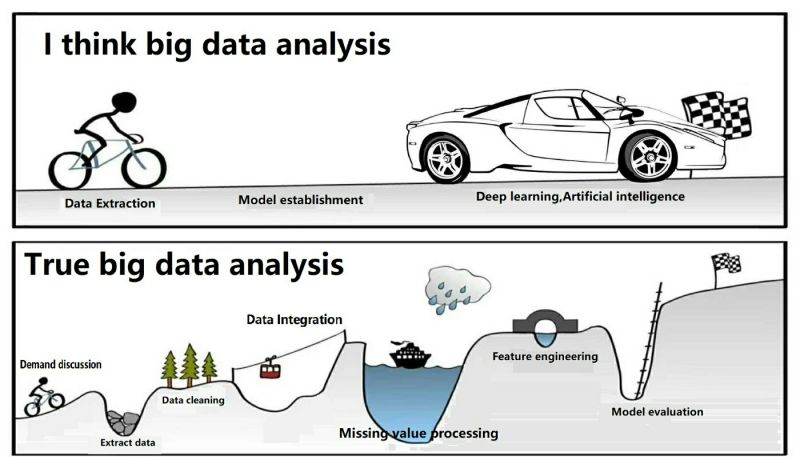

```{r, include=FALSE,warning=FALSE,message=FALSE}
options(htmltools.dir.version = FALSE)
knitr::opts_chunk$set(
  message = FALSE,
  warning = FALSE,
  dev = "svg",
  fig.align = "center",
  #fig.width = 11,
  #fig.height = 5
  cache = TRUE
)

# define vars
om = par("mar")
lowtop = c(om[1],om[2],0.1,om[4])
library(tidyverse)
library(knitr)
library(reticulate)
#use_python("C:\\ProgramData\\Anaconda3\\python.exe")
use_python("C:\\python\\python.exe")
options(dplyr.print_min = 5)
options(reticulate.repl.quiet = TRUE)
```


layout: false
class: title-slide-section-red, middle

# Exploratory Data Analysis (EDA)

Justin Post

---
layout: true

<div class="my-footer"></div> 

---

# Big Picture

- Big Data characteristics

- Course split into four topics

    1. Programming in `python` 

    2. Big Data Management

    3. Modeling Big Data (with `Spark` via `pyspark`)

    4. Streaming Data


---

# Uses for Data

Four major goals with data:
1. Description
2. Prediction/Classification
3. Inference
4. Pattern Finding

--

- First step of most analysis is to get to know your data! Done through an **Exploratory Data Analysis**


---

# EDA

- Essentially **Descriptive Statistics** with a bit more big picture stuff about your data

--

- EDA generally consists of a few steps:

    + Understand how your data is stored
    + Do basic data validation
    + Determine rate of missing values
    + Clean data up data as needed
    + Investigate distributions
        - Univariate measures/graphs
        - Multivariate measures/graphs
    + Apply transformations and repeat previous step
    

---

# Understand how your data is stored

- Should know if your data has read in how you think it should!

Read in some data (we'll learn more about this later!)

```{python}
import pandas as pd
wine_data = pd.read_csv("https://www4.stat.ncsu.edu/~online/datasets/winequality-full.csv")
wine_data.head()
```


---

layout: false

# Understand how your data is stored

- Should know if your data has read in how you think it should!

```{python}
wine_data.info()
```

---
layout: true

<div class="my-footer"></div> 

---

# Do basic data validation

- Usually look at quick summary stats of all the data to check that things make sense

```{python}
wine_data.describe()
```


---

# Determine rate of missing values

- Every programming language has indicators for missing values

- In python, we use `NaN` for 'not a number' (in `pandas`) (might use other things for missing with other data objects/modules)
--

```{python}
wine_data.isnull().sum()
```


---

layout: false

# Clean data up data as needed

May need to 

- reread data with different specifications
- fill missing values
- remove some rows and/or columns
- check your data against some gold standard?

```{r, echo = FALSE, fig.align='center', out.width = '500px', fig.cap="https://devrant.com/rants/2161326/rant"}

```


---

# Investigate distributions

Goal: Understand types of data and their distributions  

--

- Univariate measures/graphs
- Multivariate measures/graphs


---

# Investigate distributions

Goal: Understand types of data and their distributions  

- Numerical summaries  

```{r, echo = FALSE,  out.width = "260px", fig.align='center'}
knitr::include_graphics("img/summarizeAllF.png")
```


---

# Making Sense of Data  

Goal: Understand types of data and their distributions  

- Numerical summaries (across subgroups)  

```{r, echo = FALSE,  out.width = "295px", fig.align='center'}
knitr::include_graphics("img/summarizeGroupsF.png")
```

---

# Types of Data

- How to summarize data depends on the type of data  

    + Categorical (Qualitative) variable - entries are a label or attribute   
    + Numeric (Quantitative) variable - entries are a numerical value where math can be performed


```{r, echo = FALSE, out.width="500px", fig.align='center'}
knitr::include_graphics("img/variableTypes.png")
```


---

# Making Sense of Data  

Goal: Understand types of data and their distributions  

- Numerical summaries (across subgroups)  

    + Contingency Tables  
    + Mean/Median  
    + Standard Deviation/Variance/IQR
    + Quantiles/Percentiles
    

---

# Categorical Data

Goal: Describe the **distribution** of the variable  

- Distribution = pattern and frequency with which you observe a variable  

- Categorical variable - entries are a label or attribute   

--

    + Describe the relative frequency (or count) for each category

    + Called a **contingency table**

---

# Categorical Variable Summary - One-way Table

- Count the \# of times each category of **one** variable appears!

.left35[
```{python}
wine_data.type #treat like a numpy array
```
]

.right45[
```{python}
sum(wine_data.type == "Red")
sum(wine_data.type == "White")
```
]


---

# Categorical Variable Summary - Two-way Table

- Count the \# of times each **combination** of categories for *two* variables appear!

- Consider `quality` and `type`

```{python}
sum((wine_data.type == "Red") & (wine_data.quality == 3))
sum((wine_data.type == "Red") & (wine_data.quality == 4))
sum((wine_data.type == "Red") & (wine_data.quality == 5))
#etc
```


---

# Numeric Data

Goal: Describe the **distribution** of the variable  

- Distribution = pattern and frequency with which you observe a variable  

- Numeric variable - entries are a numerical value where math can be performed

--

For a single numeric variable, describe the distribution via 

+ Shape: Histogram, Density plot, ...

+ Measures of center: Mean, Median, ...

+ Measures of spread: Variance, Standard Deviation, Quartiles, IQR, ...

--

For two numeric variables, describe the distribution via 

+ Shape: Scatter plot; Measures of linear relationship: Covariance, Correlation


---

# Numerical Variable Location Summary - Mean

- Sample mean: for a variable in our data set (call it $y$)

$$\bar{y} = \frac{1}{n}\sum_{i=1}^{n}y_i$$

--

```{python}
sum(wine_data.alcohol)/len(wine_data.alcohol)
```

---

# Numerical Variable Location Summary - Median

- Sample median 
    + Sort values
    + Value with 50% of data below and above is the median
    + If even number of observations, average middle two values

--

.left45[
```{python}
sorted_alcohol = wine_data.alcohol.sort_values()
sorted_alcohol
```
]

.right45[
```{python}
len(sorted_alcohol)/2
sorted_alcohol.values[3248]
```
]

---

# Numerical Variable Spread Summary - Variance

- Sample variance is *almost* the average squared deviation from the mean
    
$$S^2 = \frac{1}{n-1}\sum_{i=1}^{n}(y_i-\bar{y})^2$$

--

.left45[
```{python}
sub = wine_data[0:4].chlorides
sub
mean_chlorides = sum(sub)/4
mean_chlorides
```
]

.right45[
```{python}
sub-mean_chlorides
(sub-mean_chlorides)**2
sum((sub-mean_chlorides)**2)/3
```
]


---

# Numerical Variable Spread Summary - Standard Deviation

- Sample Standard Deviation = square root of sample variance

    + Puts metric on the scale of the variable 

--

```{python}
import numpy as np
np.sqrt(sum((sub-mean_chlorides)**2)/3)
```


---

# Numerical Variable Spread Summary - Quantiles/Percentiles

- Sample quantile - a generalization of the median

    + $p^{th}$ quantile - value with p% of the values below it
    + Also called the 100*p%ile

--

```{python}
len(sorted_alcohol)/2
#obtain 0.25 quantile (median of lower half of the data)
(sorted_alcohol.values[1624]+sorted_alcohol.values[1623])/2
```


---

# Numerical Variable Relationship Summary - Correlation

- Sample correlation - a measure of the **linear** relationship between two variables

    + Call the variables $x$ and $y$
    + $(x_i, y_i)$ are numeric variables observed on the same $n$ units, $i=1,...,n$
    + Pearson's correlation coefficient: 

$$r = \frac{\sum_{i=1}^{n}(x_i-\bar{x})(y_i-\bar{y})}{\sqrt{\sum_{i=1}^n(x_i-\bar{x})^2\sum_{i=1}^{n}(y_i-\bar{y})^2}}$$

---

# Numerical Variable Relationship Summary - Correlation

- Sample correlation - a measure of the **linear** relationship between two variables

```{python}
wine_data.loc[0:4, ["fixed acidity", "chlorides"]]
wine_data.loc[0:4, ["fixed acidity", "chlorides"]].corr()
```

---

# Numerical Variable Relationship Summary - Correlation

- Sample correlation - a measure of the **linear** relationship between two variables

    + Sensitive to outliers
    + Spearman's correlation coefficient simply uses Pearson's correlation on the ranks of the data!

```{python}
wine_data.loc[0:4, ["fixed acidity", "chlorides"]]
```


---

# Recap

- EDA generally consists of a few steps:

    + Understand how your data is stored
    + Do basic data validation
    + Determine rate of missing values
    + Clean data up data as needed
    + Investigate distributions
        - Univariate measures/graphs
        - Multivariate measures/graphs
    + Apply transformations and repeat previous step
    
- Usually want summaries for different **subgroups of data**!!
