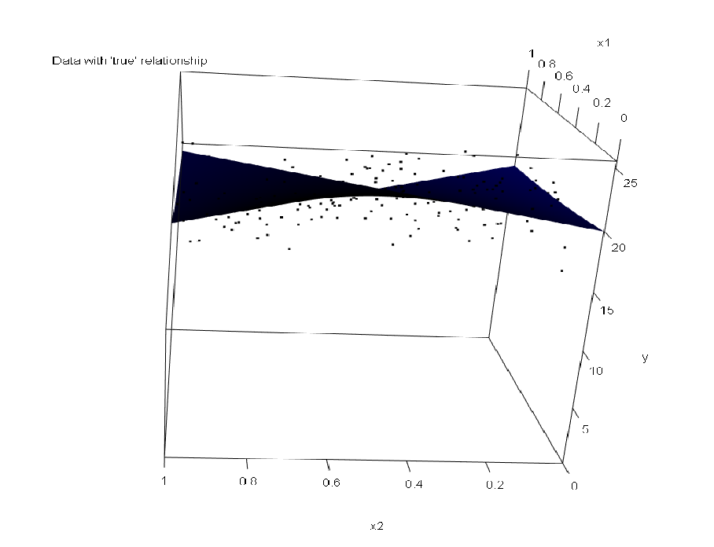
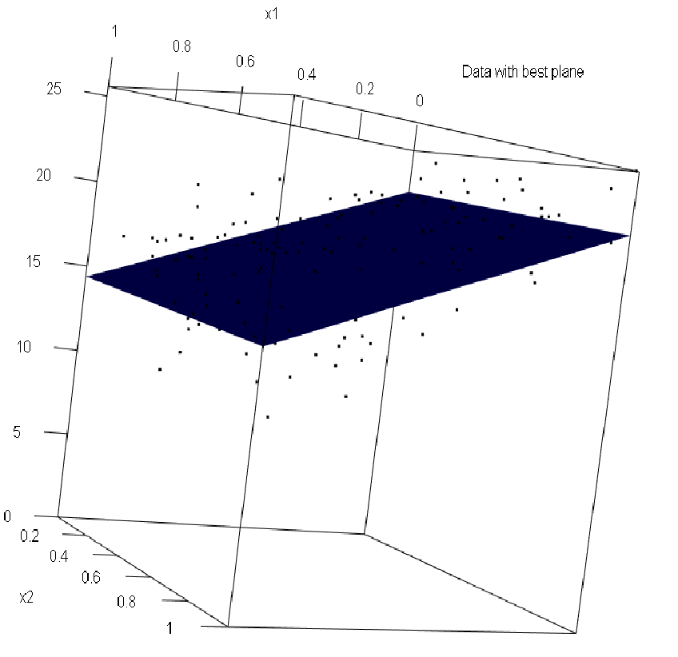
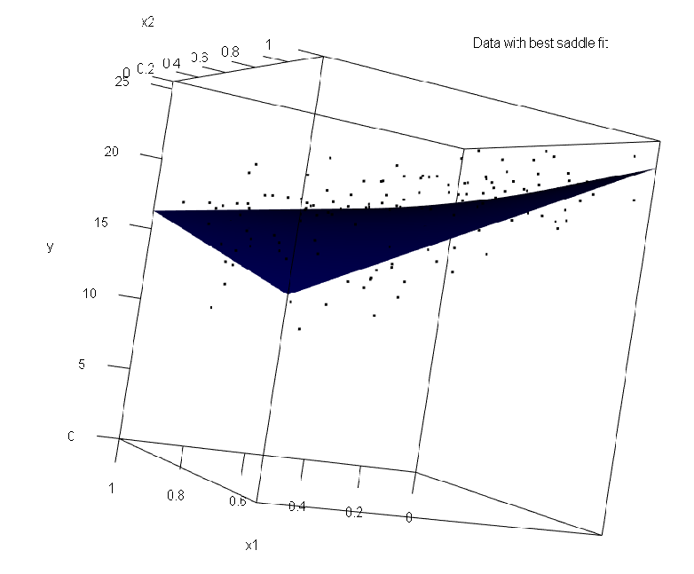
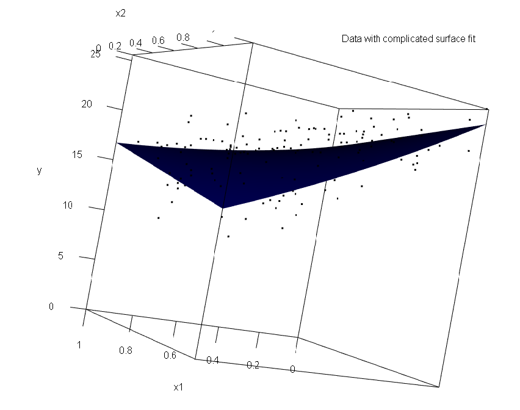

```{r, include=FALSE,warning=FALSE,message=FALSE}
options(htmltools.dir.version = FALSE)
knitr::opts_chunk$set(
  message = FALSE,
  warning = FALSE,
  dev = "svg",
  fig.align = "center",
  #fig.width = 11,
  #fig.height = 5
  cache = FALSE
)

# define vars
om = par("mar")
lowtop = c(om[1],om[2],0.1,om[4])
library(tidyverse)
library(knitr)
library(reticulate)
#use_python("C:\\Users\\jbpost2\\AppData\\Local\\Programs\\Python\\Python310\\python.exe")
#use_python("C:\\python\\python.exe")
use_python("C:\\ProgramData\\Anaconda3\\python.exe")
options(dplyr.print_min = 5)
options(reticulate.repl.quiet = TRUE)
```


layout: false
class: title-slide-section-red, middle

# Multiple Linear Regression
Justin Post 

---
layout: true

<div class="my-footer"></div> 


---

# Recap 

Given a model, we **fit** the model using data

- Must determine how well the model predicts on **new** data 
- Create a test set
- Judge effectiveness using a **metric** on predictions made from the model


---

# Regression Modeling Ideas

For a set of observations $y_1,...,y_n$, we may want to predict a future value

- Often use the sample mean to do so, $\bar{y}$ (an estimate of $E(Y)$)


---

# Regression Modeling Ideas

For a set of observations $y_1,...,y_n$, we may want to predict a future value

- Often use the sample mean to do so, $\bar{y}$ (an estimate of $E(Y)$)

Now consider having pairs $(x_1,y_1), (x_2,y_2),...(x_n,y_n)$

```{r, echo = FALSE, out.width = "370px", fig.align='center'}
set.seed(1)
x <- seq(from = -11, to = 17, by = 0.1)
y <- 300 - x^2 -20*x + 1/10*x^3
yerr <- rep(y, 5) + rnorm(length(y)*5, mean = 3, sd = 100)
plot(x, y, type = "l", lwd = 5, col = "blue", ylim = c(-250, 600), main = "Below: Blue line, f(x), is the 'true' relationship between x and y")
lines(rep(x, 5), yerr, type = "p", cex = 0.4)
```

---

# Regression Modeling Ideas

Often use a linear (in the parameters) model for prediction

$$\mbox{SLR model: }E(Y|x) = \beta_0+\beta_1x$$

```{r, echo = FALSE, out.width = "370px", fig.align='center'}
dat <- data.frame(y,x)
plot(x, y, type = "l", lwd = 5, col = "blue", ylim = c(-250, 600), main = "Below: Blue line, f(x), is the 'true' relationship between x and y")
lines(rep(x, 5), yerr, type = "p", cex = 0.4)
fit <- lm(y~x, data = dat)
lines(y = predict(fit, dat[,"x", drop = FALSE]), x = dat$x, lwd = 3)
legend("topright", legend = c("SLR fit"), col = c("black"), lty = 1, lwd = 3)
```


---

# Regression Modeling Ideas

Can include more terms on the right hand side (RHS)

$$\mbox{Multiple Linear Regression Model: }E(Y|x) = \beta_0+\beta_1x+\beta_2x^2$$

```{r, echo = FALSE, out.width = "370px", fig.align='center'}
plot(x, y, type = "l", lwd = 5, col = "blue", ylim = c(-250, 600), main = "Below: Blue line, f(x), is the 'true' relationship between x and y")
lines(rep(x, 5), yerr, type = "p", cex = 0.4)
fit <- lm(y~x, data = dat)
lines(y = predict(fit, dat[,"x", drop = FALSE]), x = dat$x, lwd = 3)
fit2 <- lm(y~x+I(x^2), data = dat)
lines(y = predict(fit2, dat[,"x", drop = FALSE]), x = dat$x, lwd = 3, col = 'Green')
legend("topright", legend = c("SLR fit", "Quad fit"), col = c("black", "Green"), lty = 1, lwd = 3)
```


---

# Regression Modeling Ideas

Can include more terms on the right hand side (RHS)

$$\mbox{Multiple Linear Regression Model: }E(Y|x) = \beta_0+\beta_1x+\beta_2x^2+\beta_3x^3$$

```{r, echo = FALSE, out.width = "370px", fig.align='center'}
plot(x, y, type = "l", lwd = 5, col = "blue", ylim = c(-250, 600), main = "Below: Blue line, f(x), is the 'true' relationship between x and y")
lines(rep(x, 5), yerr, type = "p", cex = 0.4)
fit <- lm(y~x, data = dat)
lines(y = predict(fit, dat[,"x", drop = FALSE]), x = dat$x, lwd = 3)
fit2 <- lm(y~x+I(x^2), data = dat)
lines(y = predict(fit2, dat[,"x", drop = FALSE]), x = dat$x, lwd = 3, col = 'Green')
fit3 <- lm(y~x+I(x^2)+I(x^3), data = dat)
lines(y = predict(fit3, dat[,"x", drop = FALSE]), x = dat$x, lwd = 3, col = 'Brown')
legend("topright", legend = c("SLR fit", "Quad fit", "Cubic fit"), col = c("black", "Green", "Brown"), lty = 1, lwd = 3)
```

---

# Regression Modeling Ideas

- We model the mean response for a given $x$ value
- With multiple predictors or $x$'s, we do the same idea!

```{r, echo = FALSE, eval = TRUE, fig.align='center', out.width='500px'}

```

```{r,webgl = TRUE, echo = FALSE, eval = FALSE}
library(rgl)
x1 <- seq(from = 0, to = 1, by = 0.01)
x2 <- seq(from = 0, to = 1, by = 0.01)
xy <- expand.grid(x1, x2)
names(xy) <- c("x1", "x2")
y <- 20 - 3*xy[,1] +5*xy[,2] -12*xy[,1]*xy[,2] + xy[,1]^2
obsx1x2 <- xy[sample(nrow(xy), size = 200, replace = TRUE),]
obsy <- 20-3*obsx1x2[,1]+5*obsx1x2[,2]-12*obsx1x2[,1]*obsx1x2[,2]+obsx1x2[,1]^2 + rnorm(200, sd = 2)
mlr_data <- data.frame(x1 = obsx1x2[,1], x2 = obsx1x2[,2], y = obsy)
# scatter plot with regression plane (rgl package)
plot3d(x = mlr_data$x1, y = mlr_data$x2, z = mlr_data$y,
					cex = 0.8, theta = 20, phi = 20, ticktype = "detailed",
                    xlab = "x1", ylab = "x2", zlab = "y",
					xlim = c(0,1), ylim = c(0,1), zlim = c(0, max(obsy)),
					main = "Data with 'true' relationship") 
#add surface
surface3d(x = x1, y = x2, z = y, color = "blue")
```


---

# Regression Modeling Ideas 

- Including a **main effect** for two predictors fits the best plane through the data

$$\mbox{Multiple Linear Regression Model: } E(Y|x_1,x_2) = \beta_0+\beta_1x_1+\beta_2x_2$$

```{r,webgl = TRUE, echo = FALSE, eval = FALSE}
plane_fit <- lm(y ~ x1 + x2, data = mlr_data)
# scatter plot with regression plane (rgl package)
plot3d(x = mlr_data$x1, y = mlr_data$x2, z = mlr_data$y,
					cex = 0.8, theta = 20, phi = 20, ticktype = "detailed",
                    xlab = "x1", ylab = "x2", zlab = "y",
					xlim = c(0,1), ylim = c(0,1), zlim = c(0, max(obsy)),
					main = "Data with best plane") 
#add surface
surface3d(x = x1, y = x2, z = predict(plane_fit, newdata = xy), color = "blue")
```

```{r, echo = FALSE, eval = TRUE, fig.align='center', out.width='400px'}

```


---

# Regression Modeling Ideas 

- Including **main effects** and an **interaction effect** allows for a more flexible surface

$$\mbox{Multiple Linear Regression Model: } E(Y|x_1,x_2) = \beta_0+\beta_1x_1+\beta_2x_2+\beta_3x_1x_2$$

```{r,webgl = TRUE, echo = FALSE, eval = FALSE}
saddle_fit <- lm(y ~ x1*x2, data = mlr_data)
# scatter plot with regression plane (rgl package)
plot3d(x = mlr_data$x1, y = mlr_data$x2, z = mlr_data$y,
					cex = 0.8, theta = 20, phi = 20, ticktype = "detailed",
                    xlab = "x1", ylab = "x2", zlab = "y",
					xlim = c(0,1), ylim = c(0,1), zlim = c(0, max(obsy)),
					main = "Data with best saddle fit") 
#add surface
surface3d(x = x1, y = x2, z = predict(saddle_fit, newdata = xy), color = "blue")
```

```{r, echo = FALSE, eval = TRUE, fig.align='center', out.width='500px'}

x1 <- seq(from = 0, to = 1, by = 0.01)
x2 <- seq(from = 0, to = 1, by = 0.01)
xy <- expand.grid(x1, x2)
names(xy) <- c("x1", "x2")
y <- 20 - 3*xy[,1] +5*xy[,2] -12*xy[,1]*xy[,2] + xy[,1]^2
obsx1x2 <- xy[sample(nrow(xy), size = 200, replace = TRUE),]
obsy <- 20-3*obsx1x2[,1]+5*obsx1x2[,2]-12*obsx1x2[,1]*obsx1x2[,2]+obsx1x2[,1]^2 + rnorm(200, sd = 2)
mlr_data <- data.frame(x1 = obsx1x2[,1], x2 = obsx1x2[,2], y = obsy)
saddle_fit <- lm(y ~ x1*x2, data = mlr_data)
```

---

# Regression Modeling Ideas 

- Including **main effects** and an **interaction effect** allows for a more flexible surface

- Interaction effects allow for the **effect** of one variable to depend on the value of another

- Model fit previously gives 
    
    + $\hat{y}$ = (`r round(saddle_fit$coef[1],3)`) + (`r  round(saddle_fit$coef[2],3)`)x1 + (`r  round(saddle_fit$coef[3],3)`)x2 + (`r  round(saddle_fit$coef[4], 3)`)x1x2
    
---

# Regression Modeling Ideas 

- Including **main effects** and an **interaction effect** allows for a more flexible surface

- Interaction effects allow for the **effect** of one variable to depend on the value of another

- Model fit previously gives 
    
    + $\hat{y}$ = (`r round(saddle_fit$coef[1],3)`) + (`r  round(saddle_fit$coef[2],3)`)x1 + (`r  round(saddle_fit$coef[3],3)`)x2 + (`r  round(saddle_fit$coef[4], 3)`)x1x2

    + For $x_1$ = 0, the slope on $x_2$ is (`r  round(saddle_fit$coef[3],3)`)`+0*` (`r  round(saddle_fit$coef[4],3)`) = `r  round(saddle_fit$coef[3],3)`


---

# Regression Modeling Ideas 

- Including **main effects** and an **interaction effect** allows for a more flexible surface

- Interaction effects allow for the **effect** of one variable to depend on the value of another

- Model fit previously gives 
    
    + $\hat{y}$ = (`r round(saddle_fit$coef[1],3)`) + (`r  round(saddle_fit$coef[2],3)`)x1 + (`r  round(saddle_fit$coef[3],3)`)x2 + (`r  round(saddle_fit$coef[4], 3)`)x1x2

    + For $x_1$ = 0, the slope on $x_2$ is (`r  round(saddle_fit$coef[3],3)`)`+0*` (`r  round(saddle_fit$coef[4],3)`) = `r  round(saddle_fit$coef[3],3)`

    + For $x_1$ = 0.5, the slope on $x_2$ is (`r  round(saddle_fit$coef[3],3)`)`+0.5*`(`r  round(saddle_fit$coef[4],3)`) = `r  round(saddle_fit$coef[3]+0.5*saddle_fit$coef[4],3)`
    
---

# Regression Modeling Ideas 

- Including **main effects** and an **interaction effect** allows for a more flexible surface

- Interaction effects allow for the **effect** of one variable to depend on the value of another

- Model fit previously gives 
    
    + $\hat{y}$ = (`r round(saddle_fit$coef[1],3)`) + (`r  round(saddle_fit$coef[2],3)`)x1 + (`r  round(saddle_fit$coef[3],3)`)x2 + (`r  round(saddle_fit$coef[4], 3)`)x1x2

    + For $x_1$ = 0, the slope on $x_2$ is (`r  round(saddle_fit$coef[3],3)`)`+0*` (`r  round(saddle_fit$coef[4],3)`) = `r  round(saddle_fit$coef[3],3)`

    + For $x_1$ = 0.5, the slope on $x_2$ is (`r  round(saddle_fit$coef[3],3)`)`+0.5*`(`r  round(saddle_fit$coef[4],3)`) = `r  round(saddle_fit$coef[3]+0.5*saddle_fit$coef[4],3)`

    + For $x_1$ = 1, the slope on $x_2$ is (`r  round(saddle_fit$coef[3],3)`)`+1*`(`r  round(saddle_fit$coef[4],3)`) = `r round(saddle_fit$coef[3]+1*saddle_fit$coef[4],3)`

- Similarly, the slope on $x_1$ depends on $x_2$!


---

# Regression Modeling Ideas 

- Including **main effects** and an **interaction effect** allows for a more flexible surface
- Can also include higher order polynomial terms

$$\mbox{Multiple Linear Regression Model: } E(Y|x_1,x_2) = \beta_0+\beta_1x_1+\beta_2x_2+\beta_3x_1x_2+\beta_4x_1^2$$

```{r,webgl = TRUE, echo = FALSE, eval = FALSE}
comp_fit <- lm(y ~ x1*x2 + I(x1^2), data = mlr_data)
# scatter plot with regression plane (rgl package)
plot3d(x = mlr_data$x1, y = mlr_data$x2, z = mlr_data$y,
					cex = 0.8, theta = 20, phi = 20, ticktype = "detailed",
                    xlab = "x1", ylab = "x2", zlab = "y",
					xlim = c(0,1), ylim = c(0,1), zlim = c(0, max(obsy)),
					main = "Data with complicated surface fit") 
#add surface
surface3d(x = x1, y = x2, z = predict(comp_fit, newdata = xy), color = "blue")
```

```{r, echo = FALSE, eval = TRUE, fig.align='center', out.width='500px'}

```


---

# Regression Modeling Ideas

Can also include categorical variables through **dummy** or **indicator** variables

- Categorical variable with value of $Success$ and $Failure$
- Define $x_2 = 0$ if variable is $Failure$
- Define $x_2 = 1$ if variable is $Success$


---

layout: false

# Regression Modeling Ideas

Can also include categorical variables through **dummy** or **indicator** variables

- Categorical variable with value of $Success$ and $Failure$
- Define $x_2 = 0$ if variable is $Failure$
- Define $x_2 = 1$ if variable is $Success$


```{r, echo = FALSE, out.width = "370px", fig.align='left'}
set.seed(1)
x1 <- seq(from = -11, to = 17, by = 0.1)
x2size <- 500
x2slopesize <- 3
y <- 300 - x1^2 -20*x1
yerr1 <- rep(y, 1) + rnorm(length(y)*1, mean = 3, sd = 100)
yerr2 <- rep(y*x2slopesize, 1) + rnorm(length(y)*1, mean = 3, sd = 100) + x2size
reg_data <- data.frame(y = c(yerr1, yerr2), x1 = rep(x1,2), x2 = c(rep(0, length(x1)), rep(1, length(x1))))
color_vec <- ifelse(reg_data$x2, "Blue", "Green")
plot(reg_data$x1, reg_data$y, type = "p", col = color_vec, main = "Plot of x vs y with Color by x2", 
     xlab = "x1", ylab = "y")
```


---

# Regression Modeling Ideas

- Define $x_2 = 0$ if variable is $Failure$
- Define $x_2 = 1$ if variable is $Success$

$$\mbox{Separate Intercept Model: }E(Y|x) = \beta_0+\beta_1x_1 + \beta_2x_2$$

```{r, echo = FALSE, out.width = "370px", fig.align='left'}
plot(reg_data$x1, reg_data$y, type = "p", col = color_vec, main = "Plot of x vs y with Color by x2", 
     xlab = "x1", ylab = "y")
fit <- lm(y~x1+x2, data = reg_data)
lines(y = predict(fit, reg_data[reg_data$x2 == 1, c("x1","x2")]), x = reg_data[reg_data$x2==1,'x1'], lwd = 3, col = "blue")
lines(y = predict(fit, reg_data[reg_data$x2 == 0, c("x1","x2")]), x = reg_data[reg_data$x2==0,'x1'], lwd = 3, col = "green")
legend("topright", legend = c("Fit when x2 = 1", "Fit when x2 = 0"), col = c("Blue", "Green"), lty = 1, lwd = 3)
```


---

# Regression Modeling Ideas

- Define $x_2 = 0$ if variable is $Failure$
- Define $x_2 = 1$ if variable is $Success$

$$\mbox{Separate Intercept and Slopes Model: }E(Y|x) = \beta_0+\beta_1x_1 + \beta_2x_2+\beta_3x_1x_2$$


```{r, echo = FALSE, out.width = "370px", fig.align='left'}
plot(reg_data$x1, reg_data$y, type = "p", col = color_vec, main = "Plot of x vs y with Color by x2", 
     xlab = "x1", ylab = "y")
fit2 <- lm(y~x1*x2, data = reg_data)
lines(y = predict(fit2, reg_data[reg_data$x2 == 1, c("x1","x2")]), x = reg_data[reg_data$x2==1,'x1'], lwd = 3, col = "blue")
lines(y = predict(fit2, reg_data[reg_data$x2 == 0, c("x1","x2")]), x = reg_data[reg_data$x2==0,'x1'], lwd = 3, col = "green")

legend("topright", legend = c("Fit when x2 = 1", "Fit when x2 = 0"), col = c("blue", "green"), lty = 1, lwd = 3)
```


---

# Regression Modeling Ideas

- Define $x_2 = 0$ if variable is $Failure$
- Define $x_2 = 1$ if variable is $Success$

$$\mbox{Separate Quadratics Model: }E(Y|x) = \beta_0+ \beta_1x_2+\beta_2x_1+\beta_3x_1x_2+ \beta_4x_1^2 +\beta_5x_1^2x_2$$

```{r, echo = FALSE, out.width = "370px", fig.align='left'}
plot(reg_data$x1, reg_data$y, type = "p", col = color_vec, main = "Plot of x vs y with Color by x2", 
     xlab = "x1", ylab = "y")
fit2 <- lm(y~x1*x2 + x2*I(x1^2), data = reg_data)
lines(y = predict(fit2, reg_data[reg_data$x2 == 1, c("x1","x2")]), x = reg_data[reg_data$x2==1,'x1'], lwd = 3, col = "blue")
lines(y = predict(fit2, reg_data[reg_data$x2 == 0, c("x1","x2")]), x = reg_data[reg_data$x2==0,'x1'], lwd = 3, col = "green")
legend("topright", legend = c("Fit when x2 = 1", "Fit when x2 = 0"), col = c("blue", "green"), lty = 1, lwd = 3)
```


---

# Regression Modeling Ideas

If your categorical variable has more than k>2 categories, define k-1 dummy variables
- Categorical variable with values of "Assistant", "Contractor", "Executive"
- Define $x_2 = 0$ if variable is $Executive$ or $Contractor$
- Define $x_2 = 1$ if variable is $Assistant$
- Define $x_3 = 0$ if variable is $Contractor$ or $Assistant$
- Define $x_3 = 1$ if variable is $Executive$

---

# Regression Modeling Ideas

If your categorical variable has more than k>2 categories, define k-1 dummy variables
- Categorical variable with values of "Assistant", "Contractor", "Executive"
- Define $x_2 = 0$ if variable is $Executive$ or $Contractor$
- Define $x_2 = 1$ if variable is $Assistant$
- Define $x_3 = 0$ if variable is $Contractor$ or $Assistant$
- Define $x_3 = 1$ if variable is $Executive$

$$\mbox{Separate Intercepts Model: }E(Y|x) = \beta_0+ \beta_1x_1+\beta_2x_2+\beta_3x_3$$
What is implied if $x_2$ and $x_3$ are both zero?


---

# Fitting an MLR Model

Big Idea: Trying to find the line, plane, saddle, etc. **of best fit** through points 

- How do we do the fit??

    + Usually minimize the sum of squared residuals (errors)
    

---

# Fitting an MLR Model

Big Idea: Trying to find the line, plane, saddle, etc. **of best fit** through points

- How do we do the fit??

    + Usually minimize the sum of squared residuals (errors)

- Residual = observed - predicted or $y_i-\hat{y}_i$

$$\min\limits_{\hat{\beta}'s}\sum_{i=1}^{n}(y_i-(\hat\beta_0+\hat\beta_1x_{1i}+...+\hat\beta_px_{pi}))^2$$

---

# Fitting an MLR Model

Big Idea: Trying to find the line, plane, saddle, etc. **of best fit** through points

- How do we do the fit??

    + Usually minimize the sum of squared residuals (errors)

- Residual = observed - predicted or $y_i-\hat{y}_i$

$$\min\limits_{\hat{\beta}'s}\sum_{i=1}^{n}(y_i-(\hat\beta_0+\hat\beta_1x_{1i}+...+\hat\beta_px_{pi}))^2$$

- Closed-form results exist for easy calculation via software!


---

# Fitting a Linear Regression Model in Python

- Use `sklearn` package
- Create a `LinearRegression()` instance
- Use the `.fit()` method to fit the model


---

# Fitting a Linear Regression Model in Python

- Use `sklearn` package
- Create a `LinearRegression()` instance
- Use the `.fit()` method to fit the model

```{python}
import pandas as pd
import numpy as np
bike_data = pd.read_csv("https://www4.stat.ncsu.edu/~online/datasets/bikeDetails.csv")
#create response and new predictor
bike_data['log_selling_price'] = np.log(bike_data['selling_price'])
bike_data['log_km_driven'] = np.log(bike_data['km_driven'])
```

---

# Fitting a Linear Regression Model in Python

- Use `sklearn` package
- Create a `LinearRegression()` instance
- Use the `.fit()` method to fit the model

```{python}
import pandas as pd
import numpy as np
bike_data = pd.read_csv("https://www4.stat.ncsu.edu/~online/datasets/bikeDetails.csv")
#create response and new predictor
bike_data['log_selling_price'] = np.log(bike_data['selling_price'])
bike_data['log_km_driven'] = np.log(bike_data['km_driven'])
```

```{python, eval = TRUE, echo = FALSE, include = FALSE}
from sklearn import linear_model
slr_fit = linear_model.LinearRegression() #Create a reg object
slr_fit.fit(bike_data['log_km_driven'].values.reshape(-1,1), bike_data['log_selling_price'].values)
print(slr_fit.intercept_, slr_fit.coef_)
```

```{python, eval = FALSE}
from sklearn import linear_model
slr_fit = linear_model.LinearRegression() #Create a reg object
slr_fit.fit(bike_data['log_km_driven'].values.reshape(-1,1), bike_data['log_selling_price'].values)
```
```{python}
print(slr_fit.intercept_, slr_fit.coef_)
```

---

# Fitting a Linear Regression Model in Python

```{python, fig.align = 'center', out.width = '340px', message = FALSE}
import matplotlib.pyplot as plt
preds = slr_fit.predict(bike_data['log_km_driven'].values.reshape(-1,1))
plt.scatter(bike_data['log_km_driven'].values.reshape(-1,1), bike_data['log_selling_price'].values)
plt.plot(bike_data['log_km_driven'].values.reshape(-1,1), preds, 'red')
plt.title("SLR Fit")
plt.xlabel('log_km_driven')
plt.ylabel('log_selling_price')
```


---

# Add Dummy Variables for a Categorical Predictor

- `get_dummies()` function from `pandas` is useful

```{python, fig.align = 'center', out.width = '370px', message = FALSE}
pd.get_dummies(data = bike_data['owner'])
```

---

# Add Dummy Variables for a Categorical Predictor

- `get_dummies()` function from `pandas` is useful

```{python, fig.align = 'center', out.width = '370px', message = FALSE}
pd.get_dummies(data = bike_data['owner'])
```

- If we use just the first variable created, we'll have a 1 owner vs more than 1 owner binary variable


---

# Fit a Model with Dummy Variables

- Add the binary variable and fit the model

```{python, echo = FALSE, eval = TRUE, include = FALSE}
bike_data['one_owner'] = pd.get_dummies(data = bike_data['owner'])['1st owner']
mlr_fit = linear_model.LinearRegression() #Create a reg object
mlr_fit.fit(bike_data[['log_km_driven','one_owner']], bike_data['log_selling_price'].values)
```

```{python, eval = FALSE}
bike_data['one_owner'] = pd.get_dummies(data = bike_data['owner'])['1st owner']
mlr_fit = linear_model.LinearRegression() #Create a reg object
mlr_fit.fit(bike_data[['log_km_driven','one_owner']], bike_data['log_selling_price'].values)
```

```{python}
print(mlr_fit.intercept_, mlr_fit.coef_)
```


---

# Fit a Model with Dummy Variables

Plot these fits on the same graph

```{python, fig.align = 'center', out.width = '370px', message = FALSE, eval = FALSE}
preds1 = mlr_fit.predict(bike_data.loc[bike_data['one_owner'] == 0, ['log_km_driven', 'one_owner']])
preds2 = mlr_fit.predict(bike_data.loc[bike_data['one_owner'] == 1, ['log_km_driven', 'one_owner']])
plt.scatter(bike_data['log_km_driven'].values.reshape(-1,1), bike_data['log_selling_price'].values,
            c = bike_data['one_owner'].values)
plt.plot(bike_data.loc[bike_data['one_owner'] == 0, ['log_km_driven']], preds1, 
         c = 'orange', label = "One owner")
plt.plot(bike_data.loc[bike_data['one_owner'] == 1, ['log_km_driven']], preds2, 
         c = 'purple', label = "Multiple owner")
plt.title("Different Intercept SLR Fit")
plt.xlabel('log_km_driven')
plt.ylabel('log_selling_price')
plt.legend()
```


---

# Fit a Model with Dummy Variables

Plot these fits on the same graph

```{python, fig.align = 'center', out.width = '450', message = FALSE, echo = FALSE}
preds1 = mlr_fit.predict(bike_data.loc[bike_data['one_owner'] == 0, ['log_km_driven', 'one_owner']])
preds2 = mlr_fit.predict(bike_data.loc[bike_data['one_owner'] == 1, ['log_km_driven', 'one_owner']])
plt.scatter(bike_data['log_km_driven'].values.reshape(-1,1), bike_data['log_selling_price'].values,
            c = bike_data['one_owner'].values)
plt.plot(bike_data.loc[bike_data['one_owner'] == 0, ['log_km_driven']], preds1, 
         c = 'orange', label = "One owner")
plt.plot(bike_data.loc[bike_data['one_owner'] == 1, ['log_km_driven']], preds2, 
         c = 'purple', label = "Multiple owner")
plt.title("Different Intercept SLR Fit")
plt.xlabel('log_km_driven')
plt.ylabel('log_selling_price')
plt.legend()
```

```{python, echo = FALSE}
plt.close()
```


---

# Choosing an MLR Model

- Given a bunch of predictors, tons of models you could fit!  How to choose?

- Many variable selection methods exist...

- If you care mainly about prediction, just use *cross-validation* or training/test split!

---

# Compare Multiple Models 

- We've seen how to split our data into a training and test set

```{python}
from sklearn.model_selection import train_test_split  
X_train, X_test, y_train, y_test = train_test_split(  
  bike_data[["year", "log_km_driven", "one_owner"]],  
  bike_data["log_selling_price"],  
  test_size=0.20, 
  random_state=42)  
```


---

# Compare Multiple Models 

- We've seen how to split our data into a training and test set

```{python, eval = FALSE}
from sklearn.model_selection import train_test_split  
X_train, X_test, y_train, y_test = train_test_split(  
  bike_data[["year", "log_km_driven", "one_owner"]],  
  bike_data["log_selling_price"],  
  test_size=0.20, 
  random_state=42)  
```

- Fit competing models on the training set

```{python, eval = TRUE}
mlr_fit = linear_model.LinearRegression().fit(X_train[['log_km_driven','one_owner']], y_train)
slr_fit = linear_model.LinearRegression().fit(X_train['log_km_driven'].values.reshape(-1,1), y_train)
cat_fit = linear_model.LinearRegression().fit(X_train['one_owner'].values.reshape(-1,1), y_train)
```


---

# Compare Multiple Models 

- Look at training RMSE for comparison

```{python, eval = TRUE}
from sklearn.metrics import mean_squared_error
np.sqrt(mean_squared_error(y_train, mlr_fit.predict(X_train[["log_km_driven", "one_owner"]])))
np.sqrt(mean_squared_error(y_train, slr_fit.predict(X_train["log_km_driven"].values.reshape(-1,1))))
np.sqrt(mean_squared_error(y_train, cat_fit.predict(X_train["one_owner"].values.reshape(-1,1))))
```

---

# Compare Multiple Models 

- What we care about is test set RMSE though!

```{python, eval = TRUE}
np.sqrt(mean_squared_error(y_test, mlr_fit.predict(X_test[["log_km_driven", "one_owner"]])))
np.sqrt(mean_squared_error(y_test, slr_fit.predict(X_test["log_km_driven"].values.reshape(-1,1))))
np.sqrt(mean_squared_error(y_test, cat_fit.predict(X_test["one_owner"].values.reshape(-1,1))))
```

---

# Recap

- Multiple Linear Regression models are a common model used for a numeric response

- Generally fit via minimizing the sum of squared residuals or errors

    + Could fit using sum of absolute deviation, or other metric

- Can include polynomial terms, interaction terms, and categorical variables through dummy (indicator) variables

- Good metric to compare models on is the RMSE on a test set

