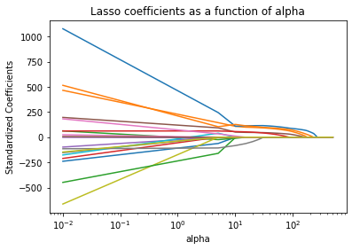

```{r, include=FALSE,warning=FALSE,message=FALSE}
options(htmltools.dir.version = FALSE)
knitr::opts_chunk$set(
  message = FALSE,
  warning = FALSE,
  dev = "svg",
  fig.align = "center",
  #fig.width = 11,
  #fig.height = 5
  cache = FALSE
)

# define vars
om = par("mar")
lowtop = c(om[1],om[2],0.1,om[4])
library(tidyverse)
library(knitr)
library(reticulate)
#use_python("C:\\Users\\jbpost2\\AppData\\Local\\Programs\\Python\\Python310\\python.exe")
use_python("C:\\python\\python.exe")
#use_python("C:\\ProgramData\\Anaconda3\\python.exe")
options(dplyr.print_min = 5)
options(reticulate.repl.quiet = TRUE)
```


layout: false
class: title-slide-section-red, middle

# LASSO Models
Justin Post 

---
layout: true

<div class="my-footer"></div> 

---

# Recap

- Judge the model's effectiveness using a **Loss** function

- Often split data into a training and test set
    + Perhaps 70/30 or 80/20
    
- Cross-validation gives a way to use more of the data while still seeing how the model does on test data
    - Commonly 5 fold or 10 fold is done
    - Once a best model is chosen, model is refit on entire data set

---

# Recap

- Judge the model's effectiveness using a **Loss** function

- Often split data into a training and test set
    + Perhaps 70/30 or 80/20
    
- Cross-validation gives a way to use more of the data while still seeing how the model does on test data
    - Commonly 5 fold or 10 fold is done
    - Once a best model is chosen, model is refit on entire data set

- Often use both! Let's see why by introducing a model with a **tuning parameter**


---

# LASSO Model

- [Least Angle Subset and Selection Operator](https://www.jstor.org/stable/2346178) or LASSO
    + Similar to Least Squares but a penalty is placed on the sum of the absolute values of the regression coefficients
    + $\alpha$ (>0) is called a tuning parameter
  
$$\min\limits_{\beta's}\sum_{i=1}^{n}(y_i-(\beta_0+\beta_1x_{1i}+...+\beta_px_{pi}))^2 + \alpha\sum_{j=1}^{p}|\beta_j|$$


---

# LASSO Model

- [Least Angle Subset and Selection Operator](https://www.jstor.org/stable/2346178) or LASSO
    + Similar to Least Squares but a penalty is placed on the sum of the absolute values of the regression coefficients
    + Sets coefficients to 0 as you 'shrink'!

```{r, echo = FALSE, fig.align = 'center', out.width = "450px"}

```


---

# Tuning Parameter

- When choosing the tuning parameter, we are really considering a **family of models**!

```{python, echo = FALSE, eval = TRUE, include = FALSE}
import pandas as pd
import numpy as np
from sklearn import linear_model

bike_data = pd.read_csv("https://www4.stat.ncsu.edu/~online/datasets/bikeDetails.csv")
#create response and new predictor
bike_data['log_selling_price'] = np.log(bike_data['selling_price'])
bike_data['log_km_driven'] = np.log(bike_data['km_driven'])
lasso = linear_model.Lasso(alpha=0.1) 
lasso.fit(bike_data[["year", "log_km_driven"]].values, bike_data["log_selling_price"].values)
```

- Consider an $\alpha = 0.1$ (small amount of shrinkage here)
```{python, eval = FALSE}
from sklearn import linear_model
lasso = linear_model.Lasso(alpha=0.1) 
lasso.fit(bike_data[["year", "log_km_driven"]].values, bike_data["log_selling_price"].values)
```
```{python}
print(lasso.intercept_,lasso.coef_)
```


---

# Tuning Parameter

- When choosing the tuning parameter, we are really considering a **family of models**!

- Consider an $\alpha = 0.1$ (small amount of shrinkage here)
```{python, eval = FALSE}
from sklearn import linear_model
lasso = linear_model.Lasso(alpha=0.1) 
lasso.fit(bike_data[["year", "log_km_driven"]].values, bike_data["log_selling_price"].values)
```
```{python}
print(lasso.intercept_,lasso.coef_)
```

- Consider an $\alpha = 1.05$ (a larger amount of shrinkage)
```{python, eval = FALSE}
lasso = linear_model.Lasso(alpha=1.05) 
lasso.fit(bike_data[["year", "log_km_driven"]].values, bike_data["log_selling_price"].values)
```
```{python, echo = FALSE, eval = TRUE, include = FALSE}
lasso = linear_model.Lasso(alpha=1.05) 
lasso.fit(bike_data[["year", "log_km_driven"]].values, bike_data["log_selling_price"].values)
```
```{python}
print(lasso.intercept_,lasso.coef_)
```


---

# LASSO Fits Visual

- Perfect place for CV to help select the best $\alpha$!

```{python, echo = FALSE, eval = TRUE, include = FALSE, message = FALSE}
#code from https://www.kirenz.com/post/2019-08-12-python-lasso-regression-auto/
import matplotlib.pyplot as plt

alphas = np.linspace(0.01,2.2,500)
lasso = linear_model.Lasso(max_iter=10000)
coefs = []

for a in alphas:
    lasso.set_params(alpha=a)
    lasso.fit(bike_data[["year", "log_km_driven"]].values, bike_data["log_selling_price"].values)
    coefs.append(lasso.coef_)
```
```{python, echo = FALSE, fig.align = 'center', out.width = "450px", message = FALSE}
ax = plt.gca()
ax.plot(alphas, coefs)
#ax.set_xscale('log')
plt.axis('tight')
plt.xlabel('alpha')
plt.ylabel('Standardized Coefficients')
plt.title('Lasso coefficients as a function of alpha');
plt.show()
```


---

# Using CV to Select the Tuning Parameter

- Return the optimal $\alpha$ using `LassoCV`

```{python, echo = TRUE, eval = TRUE}
from sklearn.linear_model import LassoCV
lasso_mod = LassoCV(cv=5, random_state=0, alphas = np.linspace(0,2.2,100)) \
    .fit(bike_data[["year", "log_km_driven"]].values,
          bike_data["log_selling_price"].values)
```


---

# Using CV to Select the Tuning Parameter

- Return the optimal $\alpha$ using `LassoCV`

```{python, echo = FALSE, eval = TRUE, include = FALSE}
from sklearn.linear_model import LassoCV
lasso_mod = LassoCV(cv=5, random_state=0, alphas = np.linspace(0,2.2,100)) \
    .fit(bike_data[["year", "log_km_driven"]].values,
          bike_data["log_selling_price"].values)
```

```{python}
pd.DataFrame(zip(lasso_mod.alphas, lasso_mod.mse_path_), columns = ["alpha_value", "MSE_by_fold"])
```


---

# Using CV to Select the Tuning Parameter

- Return the optimal $\alpha$ using `LassoCV`

```{python}
fit_info = np.array(list(zip(lasso_mod.alphas_, np.mean(lasso_mod.mse_path_, axis = 1))))
fit_info[fit_info[:,0].argsort()]
```

- Best alpha give by the `.alpha_` attribute

```{python}
lasso_mod.alpha_
```


---

# Using CV to Select the Tuning Parameter

- Now fit using that optimal $\alpha$

```{python, warning = FALSE, echo = FALSE, eval = TRUE, include = FALSE}
lasso_best = linear_model.Lasso(lasso_mod.alpha_) #ignore warning
lasso_best.fit(bike_data[["year", "log_km_driven"]].values, bike_data["log_selling_price"].values)
mlr_fit = linear_model.LinearRegression().fit(bike_data[["year", "log_km_driven"]].values, bike_data["log_selling_price"].values)
```

```{python, echo = TRUE, eval = FALSE}
lasso_best = linear_model.Lasso(lasso_mod.alpha_) #warning thrown since we are using 0, but can ignore
lasso_best.fit(bike_data[["year", "log_km_driven"]].values, bike_data["log_selling_price"].values)
```
```{python}
print(lasso_best.intercept_,lasso_best.coef_)
```


---

# So Do We Just Need CV?

Sometimes!

- If you are only considering one type of model, you can use just a training/test set or k-fold CV to select the best version of that model

- When you have multiple types of models to choose from, usually use both!
    + When we use the test set too much, we may have '**data leakage**'
    + Essentially we end up training our models to the test set by using it too much
    
---

# Training/Validation/Test or CV/Test

- Instead, we sometimes split into a training, validation, and test set
- CV can be used to replace the validation set!

```{r, echo = FALSE, fig.align = 'center', out.width = "600px"}
knitr::include_graphics("img/training_validation_test.png")
```


---

# Training/Validation/Test or CV/Test

- Instead, we sometimes split into a training, validation, and test set
- CV can be used to replace the validation set!

```{r, echo = FALSE, fig.align = 'center', out.width = "600px"}
knitr::include_graphics("img/training_validation_test.png")
```

- Compare only the **best** model from each model type on the test set

---

# Recap

- LASSO is similar to an MLR model but shrinks coefficients and may set some to 0
    + Tuning parameter must be chosen (usually by CV)
    
- Training/Test split gives us a way to validate our model's performance
    - CV can be used on the training set to select **tuning parameters**
    - Helps determine the 'best' model for a class of models 
    
- With many competing model types, determine the best from each type check performance on the test set

